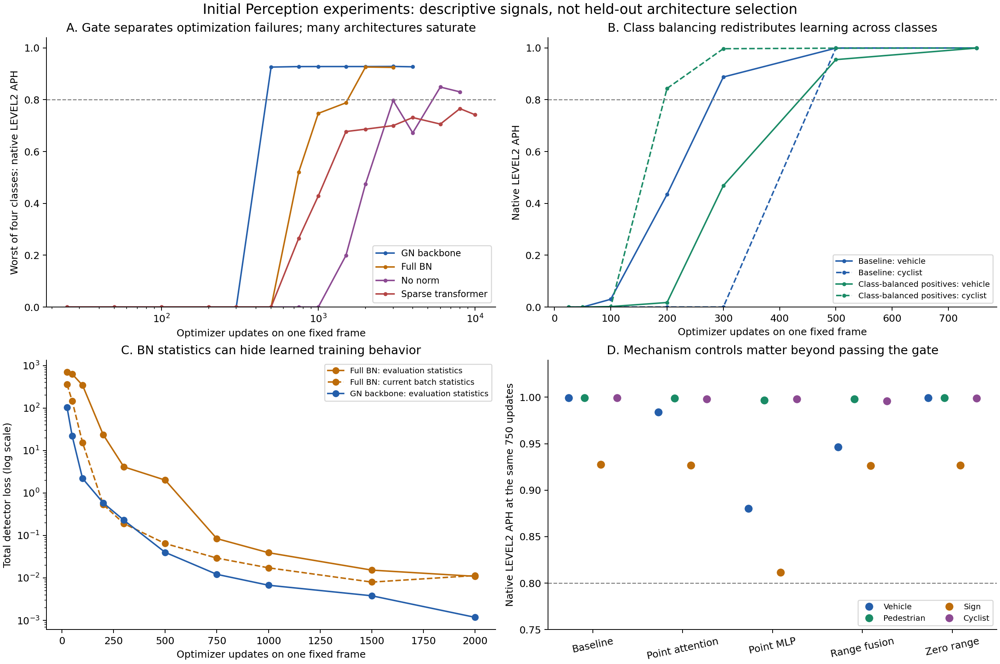

# What the initial experiments tell us to investigate next

2026-10-03. This report interprets existing verified runs. It adds no model, training execution, metric replay, or new scientific acceptance. The [source audit](2026-10-03-initial-experiments-evidence-audit.md) follows the findings to code and receipts. The [recomputed values](2026-10-03-initial-experiments-analysis.json) pin their input JSON bytes and analysis script. The script checks 23 trained rows against their final live closure reports and checks the separate cap-equivalence receipt binding; this host check does not replace those live receipts.

**Recommendation: keep the compact pillar/dense-GN detector as the reference, and resolve supervision, normalization state, and exposure effects before selecting more complex encoders. Carry point attention into a controlled follow-up; keep range fusion and the current sparse transformer exploratory. No architecture has earned scientific adoption yet.**



All panels describe the same selected 73-object training frame, seed 17, corrected decoder V3, and ROI/positive-point GT policy. Lines connect sampled checkpoints; they do not measure exact crossings. Panel D compares the same 750 updates. These are descriptive single-trial observations, with no confidence interval or held-out inference.

## First separate the three questions

1. **Can the implementation learn?** The selected all-class frame answers yes for the 4,847,144-parameter baseline and most variants. Baseline first passes all four native LEVEL2 APH thresholds at 500 updates and confirms at 750. This disproves insufficient capacity for that frame; it does not prove sufficient capacity for diverse scenes.
2. **What prevents fitting a scene mixture?** The historical 16-frame experiment exposes foreground learning weakness, missing supervision, and a substantial evaluation/batch-statistics discrepancy. Its budget is also different: exactly 125 visits per frame at 2,000 updates. These require separate interventions before blaming representation size.
3. **Which representation generalizes better?** None of these training-only results answers this. Most architectures saturate the selected frame and share the same `(300,500]` first-pass bracket. Selection needs segment-held-out scenes, multiple seeds, quality by class/distance/support, and measured resource tradeoffs.

Sources: [selected-frame curves](tier1-overfit20261002b-results.json), [expanded curves](advanced-expanded20261002a-results.json), [historical complete 16-frame records](balanced-study-recovery-20261002.json).

## The strongest evidence concerns the learning contract

**Foreground competition is visible in the curves.** The selected frame has 338/30/16/6 positive anchors for vehicle/pedestrian/sign/cyclist, despite 36/18/14/5 objects. Vehicle positives account for 86.7% of positive anchors. The reference objective sums four binary-class focal terms over 524,288 anchors and divides by the positive-anchor count; positive-anchor focal includes the other-class terms on those anchors. Initially, background focal loss is about 1,267 times positive-anchor focal loss. This is a loss ratio, not a measured gradient ratio.

Class-balanced true-positive focal weights are approximately .2885/3.25/6.0938/16.25. At update 300, baseline V/P/S/C APH is **.887/.730/.463/0**, while reweighting gives **.468/.997/.865/.997**. Rare classes learn sooner and vehicles later. Both pass at 500 and confirm at 750. The .01 foreground-prior treatment also improves early foreground behavior, but confirms at 1,000 because sign quality delays its gate. Neither intervention is established as faster all-class fitting. [Exact objective](../pipeline/detector_loss.py), [reweighting and bias](../tier1/models.py), [curves](tier1-overfit20261002b-results.json).

**The low total loss in balanced16 is misleading as a success criterion.** Baseline mean loss falls 1,564.662→1.073, a 99.93% reduction. Background focal falls 1,558.205→.0718, while positive-anchor focal falls only .7084→.2417. Native class scores remain poor. We need per-class positive scores, box geometry, proposal survival, and native AP/APH alongside total loss. [Verified producer records and scores](balanced-study-recovery-20261002.json).

**Normalization state is a concrete candidate cause.** Full BN on the selected frame has evaluation loss 2.010 versus batch-statistics loss .0644 at update 500. In the earlier 17-object experiment, recalibrating BN with physical observations and frozen weights changed loss .05814→.00748 and historical mean APH .738→.864 with zero optimizer updates. That is causal evidence about those BN buffers, not a current all-class success. [Frozen-weight intervention](one-batch-bn-counterfactual-verified.json), [native scoring](one-batch-bn-counterfactual-scoring-verified.json).

Even the GN-backbone baseline retains **pillar BN**. Its balanced16 terminal mean evaluation loss is **1.0732**, versus **.2950** using buffer-restored current-frame statistics; localization is **.3248 versus .0494**. Residual BEV has an even larger total-loss gap, **1.2669 versus .2948**. We have not established native quality from those counterfactual 16-frame statistics, so a frozen-weight native comparison is the appropriate next test. Pillar LN already fits the selected frame, making it a plausible separate normalization treatment. A batch size of one does not alone invalidate BN: its reduction includes points/spatial positions. [Producer component records](balanced-study-recovery-20261002.json), [normalization axes](../gpu/norm_variants.py), [pillar BN/padding](../pipeline/pillar_encoder.py).

**Exposure must be measured per frame.** Matching 500/750 single-frame visits across sixteen frames requires 8,000/12,000 total updates. This is accounting, not a prediction that the mixture will fit then. The historical run used shuffled permutations; the approved sustained run uses round robin. They are different trajectories. Report per-frame visits and forgetting as well as aggregate updates. [Historical sampler](../cohort/train_balanced.py), [new sampler](../cohort/sustained_loop.py).

**Target coverage is a separate problem.** All 29 missing signs and the missing pedestrian have positive maximum overlap, but the assignment chooses a competing GT at their best anchors. Twenty-eight conflicts are within the same class. Ideal predictions of covered targets yield sign APH **.759399**, while ideal predictions of all ROI training-eligible targets yield **.868421** against the same full native GT. This is evidence for a separate coverage/geometry investigation. It is not a universal detector ceiling: a model can produce unassigned objects. Keep every native GT object in evaluation. [Independent cause reconstruction](balanced16-coverage-causes-verified.json), [native ideal controls](balanced16-coverage-oracle-status.md).

## Which architecture directions deserve further work?

| Direction | Evidence available | Research decision now |
|---|---|---|
| GN backbone, clipped Adam, compact PFN/CNN | Reliable selected-frame fit. Full BN, no norm and no clipping fit later under this recipe. | Keep as reference. Test pillar normalization separately; do not call it BN-free. |
| Residual BEV and masked pooling | Same-size residual improves the earlier 17-object result; both fit the all-class frame. Residual does not improve the historical 2,000-update mixture. | Low-cost candidates, with no adoption yet. Finish the matched mixture comparison. |
| More pointwise PFN depth/context | No faster sampled all-class fit. Extra depth adds only 4,224 parameters, approximately .087%. Context also changes masking and normalization. | No evidence for promotion; this was not a meaningful large-capacity test. |
| Grid/retention/ragged pillars | All fit; grouping changes point coverage and stride. Ragged also changes centroid and BN population. Fine grouping hits the pillar cap. | Choose follow-ups from object-support failures and resource measurements, not cell size alone. |
| Point attention | At update 750, vehicle/sign APH .984/.927 versus .880/.811 for its equal-parameter MLP control. Both share the same fitting bracket. | Promising local comparison. Test repeatability, failure IDs and held-out benefit before promotion. |
| Range-to-pillar fusion | At update 750, vehicle APH .946 versus .999 for the zero-range control; neither fits earlier. | No demonstrated advantage. Inspect branch usage and sparse/distant regimes before expanding it. |
| Sparse occupied-token BEV transformer | Vehicle APH .742 after 10,000 updates. Capacity drops from 4.847M to 2.065M and dense spatial propagation changes too. | Reject advancement of this recipe for now. Preserve the broader direction; separate capacity, support and propagation hypotheses. |

Sources: [earlier architecture cohort](architecture-first-cohort-results.md), [matched all-class curves](tier1-overfit20261002b-results.json), [expanded curves](advanced-expanded20261002a-results.json), [support diagnostic](sparse-head-support-status.md), [detailed confound audit](2026-10-03-initial-experiments-evidence-audit.md).

The single-frame sparse-support audit finds one vehicle with no locally supported positive anchor and 30 unsupported vehicle-positive anchors. That cannot by itself explain the whole vehicle-quality gap. The range zero control computes the same branch and zeroes gathered features; it is not a no-compute baseline. A successful fit in that pair does not show that range information is useful.

## An experiment should discriminate a cause

The following order preserves the approved four-recipe experiment. Additional diagnostics/treatments below are recommendations, not modifications to its frozen targets or acceptance rule.

| Priority / question | Goal and experiment | Verifier and acceptance / interpretation |
|---|---|---|
| 1. Where are objects lost? | Create an object-level ledger: native eligibility, ROI, raw/retained support, assignment, best decoded IoU, score-floor/top-k survival, NMS, native match and heading error. Link failures to camera/LiDAR views. | Independently reconcile source IDs and all GT, with literal geometry/proposal checks in live Insula. Clearly separate annotated oracle diagnostics from learned predictions. A missing positive assignment, poor geometry, low rank, suppression loss, and heading error must be distinguishable. |
| 2. Is inference normalization hiding learning? | Score identical frozen balanced16 weights using the original state and a training-only BN recalibration diagnostic; evaluate a separately frozen pillar-LN treatment if warranted. | Bitwise unchanged learned weights, declared buffer changes, unchanged decoder/full-native GT and independent native replay. Native quality rescue supports a normalization-state explanation; lower diagnostic loss alone does not. Never calibrate on held-out targets or change the current run implicitly. |
| 3. Do optimization controls scale with exposure? | Complete approved baseline/residual/class-balanced/prior matrix on the same 16 frames, with up to 32,000 updates and the existing 7,200s training cap. Inspect quality at equal visits and whether other-frame updates erase learned objects. | Existing gate: every class LEVEL2 APH ≥ .8 at two consecutive prescribed samples including terminal; exact state/head replay, independent losses/export/native metrics, resources, and verified HDFS recovery. Native scoring now has a separate 14,400s budget. No mean-loss substitute. A censored negative is an outcome, not success. |
| 4. Can positive supervision cover the missed objects? | Run a separately specified assignment/geometry control on the same native GT, beginning with literal reconstruction of conflicts and coverage-preserving feasible matches. | Preserve observations and all 1,279 native evaluation boxes. Independently verify target geometry, object-ID coverage, ties and no leakage. Improve the ideal-target coverage diagnostic, then require learned native gains; an oracle improvement alone cannot promote a model. |
| 5. Which representation is worth scaling? | Shortlist compact baseline, normalization/pooling or residual treatment, and point attention with its MLP control. Compare range versus zero only in a stated regime. Move capable candidates to fixed segment-held-out trials and multiple seeds. | Freeze quality estimands, class non-inferiority margins and resource budgets before running. Require a repeatable held-out advantage with segment-level uncertainty; training-only saturation cannot select the winner. Detection success does not close point segmentation, SAM transfer or forecasting tasks. |

Tasks [28](../../../docs/research/tasks/28-pillar-encoder-architecture.md), [29](../../../docs/research/tasks/29-bev-backbone-architecture.md), and [32](../../../docs/research/tasks/32-architecture-tier1-and-promotion.md), plus the [approved sustained plan](../../../docs/superpowers/plans/2026-10-03-balanced16-sustained-overfit.md), already locate the core work. The [program task index](../research-task-index.md) retains the wider scientific objectives.

**Actionable goal:** identify the dominant causes of the 16-frame fitting failure, verify a recipe that sustains all four native class gates without dropping GT, and advance only a small set of controlled representations to held-out comparisons. If the fixed target/ROI contract still fails after its full budget, record that result and investigate coverage/geometry under a separate treatment. Do not lower the gate to manufacture an architecture winner.

Reproduce the descriptive values and figure:

```bash
uv run --no-project --with matplotlib==3.10.0 python experiments/waymo-perception/research/2026-10-03-initial-experiments-analysis.py
```

Historical qualification: the baseline 2,000-update mixture has now been independently rescored with V3 and full native GT (APH .281619/.242956/.0236408/.00190988). Its old V2/ROI figures remain historical, and no matched residual V3/full-GT result is established here. Do not interpret that scope change as a controlled decoder or architecture improvement. [New baseline score and replay](balanced16-v3-native-scoring-status.md).
