# PointPillars training deep dive

2026-10-01. Discussion draft; no new model recipe adopted. See [source audit](pointpillars-source-architecture-training-audit.md) for paper and author-code citations.

## Current architecture

```mermaid
flowchart LR
 A[Five LiDARs / two returns: XYZ and intensity] --> B[0.25 m XY pillars / max 20000 / 32 points]
 B --> C[9 features: XYZ, intensity, cluster XYZ, center XY]
 C --> D[Linear 9 to 64 / padded BN / ReLU / point max]
 D --> E[BEV scatter: 64 x 512 x 512]
 E --> F[Conv stages: 4 / 6 / 6 layers; 64 / 128 / 256 channels]
 F --> G[Upsample and concatenate: 384 x 256 x 256]
 G --> H[8 anchors per cell: 4 logits / 7 residuals / 2 direction logits]
 H --> I[Decode / score floor / class-agnostic enclosing NMS]
 I --> J[Measured-point metadata / protobuf / native metrics]
```

The spatial stages are 256²,128²,64². All three branches reach256² before concatenation. There are524,288 anchors and4,847,144 learned parameters. This is a Waymo adaptation of the original car backbone; the original pedestrian/cyclist head spacing differs. Ground-truth labels, NLZ, IDs and point lineage never enter the encoder.

## Observed run

Fresh seed17; fixed16 training frames/13 scenes; Adam1e-4, no decay, batch1, clip10; 2000 updates, no augmentation or resampling. Initial and final evaluation losses:2995.379291534424 and1.9208379872143269. The [independent live training audit](native-overfit-training-audit-verified.json) replayed all16 final heads exactly, reconciled initial/final losses with separate literal formulas and checked optimizer counters and frame order.

The [native scoring run](native-overfit-scoring-verified.json) reports LEVEL2 APH vehicle.0203737, pedestrian.000104446, sign.00229486, cyclist0; equal populated-class mean.0056932515, below.8. This receipt still needs independent geometry/export/scoring admission. The candidate cannot be called a successful overfit based on the loss alone.

[Live observational head diagnostics](native-overfit-head-diagnostics.json), not a separately admitted scientific result, found:

| Class | Positive anchors | Highest-logit class correct on positives | Direction-bin accuracy | Exported proposals from positive anchors |
|---|---:|---:|---:|---:|
| Vehicle |3602|98.42%|73.63%|380|
| Pedestrian |263|84.79%|62.74%|17|
| Sign |259|94.21%|85.71%|35|
| Cyclist |3|0%|100%|0|

These are anchor-level diagnostics, not object recall. Relative class correctness does not imply high foreground confidence. Across16 frames,49,723 background-labelled anchors exceed the.05 floor;8000 proposals are exported, only432 originating from positive training anchors. Negative/ignored anchors can still regress to valid detections, so these counts alone cannot prove which detections are wrong. Cyclist's three anchors make the class especially weakly supported. There are750 eligible GT boxes including19 uncovered objects; preserve all of them in overfit scoring.

## Investigation tasks and acceptance

| Task | Goal | Verifier and acceptance |
|---|---|---|
| D1: end-to-end convention audit | Rule out coding/export/scoring faults | Independent live decode, NMS, point-count/NLZ and protobuf reread; exact-target diagnostic heads recover GT under declared matching limits. Keep trained primary metrics untouched. |
| D2: positive learning | Explain the discrepancy between loss reduction and APH | All16 frames: positive/negative loss contributions, foreground probabilities, per-head gradients and clipping frequency; separate classification/ranking from box quality. No causal finding from a total-loss ratio. |
| D3: normalization | Test batch1/running-statistics effects | Frozen checkpoint clones, same observations, train versus eval mode; no optimizer updates and no checkpoint mutation. Report all-frame loss/logit/error differences. |
| D4: geometry and support | Locate assignment/retention/localization failures | Every eligible GT: native and retained point support, anchor overlaps, assigned positives, best predicted same-class box overlap and center/dimension/yaw errors. Retain uncovered GT. |
| D5: proposal selection | Measure ranking and suppression losses | Same frozen heads: pre/post-NMS object recall, class-wise versus class-agnostic and rotated versus enclosing diagnostics. Declare oracle experiments separately. No posthoc replacement of primary score. |
| D6: controlled training changes | Improve learning based on diagnosed bottleneck | One-factor matched reruns; same16 frames, seed,2000-update budget, scorer and all eligible GT. Independent live receipts and AP/APH/resource comparisons; retain failures. Overfit threshold remains.8, not lowered. |
| D7: full-study recipe | Establish generalization-ready training | Separately registered train/dev/heldout protocol, schedule, geometry-correct augmentation, seeds, uncertainty and resources; heldout data never selects fixes. |

## Candidate changes, not adopted remedies

- Optimization: foreground-prior bias, learning-rate/schedule and clipping policy. Low-prior bias is not an omitted author-code feature; evaluate it as a deliberate experiment.
- Representation/support: finer detection spacing, class-aware anchors/assignment, point/pillar-cap changes. These alter measurable target/point support and require coverage reports.
- Normalization: running-statistics recalibration or another normalization only if D3 supports the hypothesis. Padded-slot BN matches author code; changing it is an experiment.
- Postprocessing: class-aware/rotated suppression. Evaluate on frozen heads first so improvements are not conflated with retraining.
- Generalization: physical transforms and train-only database sampling after the overfit correctness gate. Do not add augmentation to hide a failed memorization test.
- Later architecture studies: range-view encoding, sparse voxel/SWFormer mechanisms and camera fusion. Compare them after the baseline's task contract works; increased capacity alone is not a diagnosis.

Open discussion decision: audit/fix baseline first (recommended), or investigate upgrades alongside it. Existing data, checkpoints, native metrics and research scope are preserved. No new architecture/training change has been executed for this discussion.
