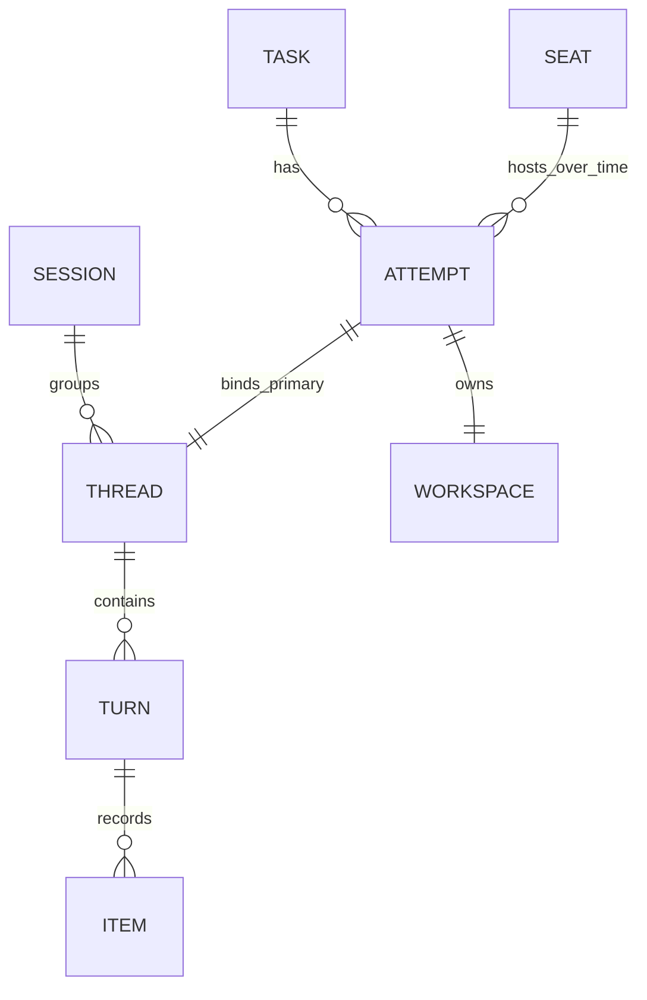

# Codex session, thread, turn and task-attempt model

Status: normative companion approved with the full v1 specification on 2026-10-04 UTC (2026-10-03 client date). Required vocabulary/identity contract for worker attempts50 and overview54; no runtime implementation is claimed.

## Native entities

The installed daemon 0.160.0 schema and [official App Server documentation](https://learn.chatgpt.com/docs/app-server) distinguish:

| Entity | Identity / lifetime | Protocol meaning |
| --- | --- | --- |
| Session | `thread.sessionId`, supplied by runtime; groups a live session tree | Navigation/grouping only; forked threads may share it. Not a task owner, connection or OS process |
| Thread | `thread.id`; durable conversation branch with history and runtime status | Exact primary worker address. Read actual sessionId, forkedFromId and parentThreadId; do not derive grouping/ancestry from naming |
| Turn | `(threadId, turn.id)`; one execution cycle with items, status, timestamps/error | A unit of observed work, potentially multiple model/tool steps; not a task or attempt |
| Item | `(threadId, turnId, itemId)` where exposed; message/tool/action/result within a turn | Source anchor for summary/evidence; not all items are suitable for public summaries |
| Goal | Current thread-scoped objective/lifecycle/budget; no separate ID in inspected schema | Bind `(threadId, createdAt, objectiveDigest)` and update provenance; can span many turns |
| Runtime connection/process | Controller-recorded daemon/connection identity and owned tool-process handles | Execution/liveness context. Multiple threads can share a daemon PID; connection loss is not thread completion |

Root and ordinary forked threads can have different thread IDs but the same sessionId. Ephemeral/fork variants are runtime-specific; always read the returned sessionId. `forkedFromId` is fork provenance, while `parentThreadId` is separately observed agent ancestry; neither grants ownership.

This is the proposed managed-work relationship, not a claim that native Codex threads always belong to a Sureal task. Only explicitly admitted thread bindings enter the managed view.

## Sureal bindings and cardinalities

A Task is the stable committed ticket/spec and linked Kata issue. An Attempt is one admitted execution of its pinned brief/base with one current claim generation. A Seat is capacity, reused only after safe stop/retention/cleanup. Workspace is the attempt-owned worktree/branch and mutable output paths.

For v1, each admitted attempt binds exactly one primary worker thread and one workspace. A task may have multiple historical attempts, but only one active owner; there are two concurrent seats for independent tasks. The primary thread may contain many turns. Each new attempt starts a fresh primary thread; repairs within an unchanged still-live attempt waiting for review may use additional turns. EXITED/FINISHED attempts require a fresh claim/thread/workspace for repair, preserving the admitted brief/base and prior evidence. A takeover, stale-base refresh or materially revised brief creates a new admitted attempt/claim/thread/workspace with explicit retained-work inputs.

Kata assignment metadata and controller receipts include `task_id`, spec/brief pins, `claim_generation`, `attempt_id`, `seat_id`, `session_id`, **`thread_id`**, workspace/branch/base and runtime-instance identity. Capture current/last `turn_id` and source item references for progress, not as the ownership key. `session_id` alone is insufficient to assign, message, stop, summarize or release a worker. CLI/API destinations use the exact thread ID when their installed contract expects a thread.

V1 should create independent worker roots with `thread/start` rather than copying the lead's conversation. A fork has a new thread ID and may carry prior history, but receives no task claim, goal authorization or writable workspace by inheritance. Any additional concurrent writable worker thread needs its own admitted seat/worktree; shared session grouping does not provide extra capacity. Inherited fork-history items are provenance, not progress performed by the new attempt. Read-only review threads, if later admitted, must have explicit role/scope and independent evidence identities.

## Turns, continuation and state

The inspected TurnStatus values are `inProgress`, `completed`, `interrupted`, `failed`. A completed turn says that execution cycle ended; it does not say the objective or task passed. An active goal can pursue work across completed turns, including idle gaps between eligible continuation turns. Steered input may enter the existing turn; a message is not necessarily a new turn. Standalone tool/maintenance activity can also appear as a turn, so retain actual trigger/type provenance where available.

The controller requests at most one in-flight turn per primary worker thread. Two-worker concurrency means separate primary threads and workspaces, not competing turns on one conversation. A turn/transport interruption does not prove all background tool processes stopped. Stop/release evidence must reconcile thread activity, goal continuation/queued work and owned outstanding process/tool effects under the applicable authorization.

`thread/resume` rejoins an existing conversation with the same thread identity; a new CLI/connection/daemon attachment is not automatically a new task attempt. Compaction changes context representation, not ownership identity or demonstrated progress. Fork creates a distinct thread and requires explicit binding. A daemon restart leaves durable history while current runtime/process facts must be reconciled; UNKNOWN is appropriate until observed.

Each worker card shows native session/thread/current turn and goal lifecycle alongside the [operating-state/health contract](2026-10-03-worker-session-state-design.md), attempt lifecycle and task verification/landing. A turn can be completed while the worker is PURSUING between turns, BLOCKED on a prerequisite, or FINISHED with verification still pending. Scope summaries to the attempt's admitted turn/item range; inherited history or another fork in the same session cannot manufacture current progress.

## Implementation verifiers

- Live readback proves two exact primary thread IDs and distinct task worktrees, plus actual sessionId/native runtime identities; shared daemon PID is permitted and not treated as shared task ownership.
- A controlled native fork/read fixture proves grouping can share sessionId while thread/turn evidence and claims remain distinct. Fork-history attribution is refused. Fixtures follow explicit scope and runtime authorization.
- Resume/reconnect and multiple turns retain the same claim/attempt; takeover/stale refresh retain old history and bind new identities. Compaction, archive/retention and source gaps cannot silently substitute another thread.
- Completed/interrupted/failed turns do not close Kata tasks, mark goal/task acceptance or release a seat. Actual outstanding tools and queued/goal continuation remain accounted for.
- Summary/command/claim joins reject right-session/wrong-thread, wrong turn/attempt/generation, inherited history and PID reuse. Runtime-instance/process handles include enough incarnation evidence to detect stale observations.

Detailed live checks are incorporated into tickets50/54 and the admitted implementation plan. This document supplies identity semantics, not a new owner registry or API wrapper framework.
