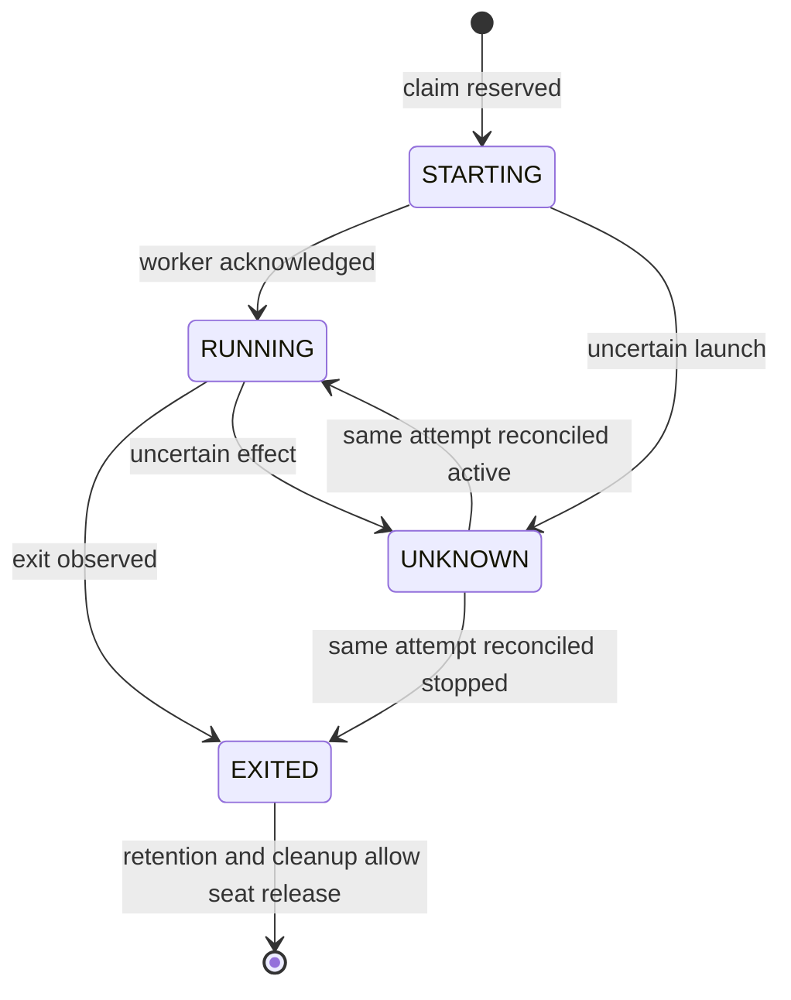

# Sureal-local two-worker collaboration protocol

Status: design proposal. Implementation home is settled: all code, specs and task definitions belong to Sureal. Corenius is a read-only design reference. Implementation starts after integration closeout, verified pristine mainline and written design/plan review.

## Goal

Replace long-lived divergent implementation worktrees and conversational task handoff with one persistent lead, two concurrent worker seats from v1, bounded task briefs, task-scoped Git workspaces, immutable candidates, exact-candidate verification and conditional fast-forward landing.

Sureal is the managed project and implementation home. Its canonical ref remains `refs/heads/phi9t/mainline`; the attachment's `main` is a role, not an instruction to rename a branch. The existing models/training task specs 44–48 remain the first scientific architecture workstream after protocol adoption.

## Preconditions: pristine mainline

Before starting managed execution, the current worker completes its current task and closes out integration:

- Inventory tracked edits, untracked source/spec/evidence and outstanding commits across all owned workspaces.
- Land verified owned contributions to `phi9t/mainline`; retain large scientific artifacts through the current exact-readback/live-recovery HDFS mechanism rather than committing raw payloads.
- Record the disposition of every outstanding contribution. No unique work disappears through worktree deletion, ignore rules or ancestry-only accounting.
- Reconcile the models/training documentation commit `51f1b39` and the root's earlier untracked proposal deliberately.
- Stop/release active mutating attempts and account for any retained scientific execution. No process may continue writing the canonical checkout or a workspace being retired.
- Verify that tracked/index/untracked state in the canonical source checkout is clean and that the expected integration revision has been published and independently re-read when publication is required.
- Record the exact accepted transition base B and the closeout evidence. Existing history is preserved; linear one-commit managed tasks apply from B onward.

“Single mainline” means one authoritative integration ref and no unaccounted divergent owned work. Historical refs and frozen source packages may remain when required by provenance. Removing existing worktrees or branches requires an explicit safe disposition; this protocol does not silently authorize historical deletion.

## Roles and authority

- **Lead:** persistent reasoning session; decomposes work, chooses the next admitted brief, reviews the exact candidate and requests landing. It does not repair a submitted candidate in place.
- **Worker seat:** at most one active task attempt per seat. Initial capacity is two seats, with concurrent independent tasks required for v1 admission. Each attempt starts a fresh worker thread/process in its own mutable workspace.
- **Controller:** a small local CLI owns state transitions, workspace identity, the exclusive protocol lock, candidate retention and integration. It does not invent task acceptance or interpret model output as proof.
- **Human:** owns intent, architecture and applicable integration/publication authorization. Record the applicable Sureal landing delegation with the admitted task before its first managed landing. Authority never extends to another repository or branch.

The CLI and lead are distinct roles even if both are operated in the same terminal. Task acceptance remains an evidence-backed decision.

## One task, one exact base, one candidate

Task brief includes stable task ID, intent revision/digest, linked Git task spec, outcome, allowed scope, exclusions, required verification, resource rules and exact base B. A material brief change creates a new admitted revision; it is not a silent prompt edit.

At start:

1. Acquire the controller lock, verify the pinned task spec/plan is on admitted mainline B, reserve its Kata owner through a unique attempt actor and durable controller intent and allocate a free worker seat within admitted capacity. In v1 capacity is two; each active or unresolved attempt occupies its own seat. Refuse a third start and duplicate task ownership.
2. Recheck canonical mainline equals admitted B and is clean.
3. Create a task workspace outside the canonical source checkout, on a unique disposable `codex/<task-id>/<attempt-id>` branch at B. A linked Git worktree is the recommended initial mode.
4. Record Kata issue/owner/revision, claim ID/generation, workspace kind/path, Git common-directory identity, branch, seat and attempt identity before launching the worker; capture/reconcile the actual worker session and process identities.
5. Launch a fresh bounded worker with the exact admitted brief and claim identities; require its matching acknowledgement before RUNNING and retain startup/exit provenance. Lost acknowledgement leaves STARTING/UNKNOWN ownership reserved.

## Workspace isolation and concurrent workers

A linked worktree has separate working files, index and HEAD, while sharing the repository's object store, ordinary branch refs and configuration by default. It supports multiple concurrent branches efficiently. Therefore workers must own unique branches, and only the controller may change canonical mainline under the protocol. This is a cooperative authority rule: worktrees do not technically prevent arbitrary Git commands from modifying shared refs.

A clone has its own Git metadata and refs. It is an alternative when independent Git metadata is useful; it is not required for task isolation. Local clones may hardlink objects, and `--shared`/`--reference` can borrow objects from another repository. Any clone mode must record and verify its actual object dependencies before claiming independent retention. Neither mode supplies OS security isolation. Insula writable-path/process restrictions must be established by actual execution probes.

Recommend implementing linked worktrees first. Retain workspace kind in records so a clone mode can be added deliberately; do not advertise an unimplemented mode or introduce a generic adapter framework. Verification may use a fresh detached worktree or source snapshot with declared output paths, independently of worker workspace kind.

Record ownership per seat, task and attempt rather than using one project-wide mutable `active_task` identity. v1 runs two worker sessions concurrently, each in a distinct worktree and unique branch. Attempts also own separate writable output/cache/log directories; immutable input data may be shared. Concurrent writable attempts never share a task worktree, branch or mutable build workspace. Clone mode remains optional.

The lead selects independent ready tasks with declared write scopes. The controller rejects overlapping or unresolved write/resource ownership before dispatch, including parent/child directory overlap and shared scientific outputs. Dependent tasks wait for their predecessor's verified closure; two seats do not permit bypassing the models/training44–48 chain. Each worker can develop while the other is active; global lock sections reserve/reconcile state and integrate candidates, never span a worker's whole execution or a wait for resource availability.

Landing remains serialized through the controller. Only the submitted attempt must be stopped/frozen; unrelated work in the other worktree can continue. The existing exclusive GPU lock still permits only one scientific GPU execution at a time. Kata records waiting-for-resource separately from actual executing state; worker capacity two does not increase admitted GPU/RAM/storage limits.

If both workers start at B, landing C makes another candidate D with parent B stale. D must explicitly refresh its base to C through a newly recorded attempt/claim and produce a newly verified candidate before landing. Preserve D, its evidence and any unsubmitted work before refreshing. The fresh attempt starts in its own worktree at C and applies explicitly retained prior work under the unchanged admitted brief; it does not silently inherit D's verification. More clones do not avoid this integration issue. No automatic rebase or reuse of old verification at landing is allowed.

Worker produces one commit C with exactly one parent B. Development and repair may amend only its own disposable candidate line when the approved brief grants that operation; shared branches and historical commits are never amended.

Submission requires the correct owned workspace, exact base, one task commit, no merges and a clean index/working tree/untracked state. Build outputs must follow declared paths. Submission retains C/tree/brief/attempt identities, a report and evidence, and records the frozen candidate before allowing review.

Candidate identity is the commit/tree plus its exact task/brief/base/attempt context, never a mutable branch name. Preserve candidate objects in a controller-owned reference or verified bundle before amendment or workspace removal.

## Verification and repair

Verification materializes candidate C in a fresh read-only-source snapshot or detached verification workspace with declared output paths and fixtures. It must not test a mutable worker checkout whose ignored files or later edits can change the result.

Record C, tree, B, brief digest, check commands, fixture/runtime/source identities, start/end/exit, logs, resource usage and independently reopened artifact hashes. A worker report is evidence to inspect, not an acceptance token.

Sureal implementation milestones retain the existing actual live Insula requirement and independent mathematical/artifact checks. Two agent sessions do not imply that the producer and verifier should share implementations. Host unit tests complement live proof.

A failed review returns bounded findings to the worker through an explicit repair transition. Retain rejected C1 and its evidence. Repair submits a new C2; C1 verification cannot authorize C2. Mainline movement makes the attempt stale; refresh B explicitly and obtain a newly verified candidate. No automatic rebase during landing.

## Landing

Under the exclusive controller lock:

- Current mainline is clean and still exactly B.
- Current submitted candidate is C, has one parent B and the expected tree.
- The brief, workspace and candidate identities match the accepted verification.
- Required checks/review and any configured landing authorization apply to C.
- The submitted attempt is stopped/frozen and has no uncertain effect. The other seat may remain active in its distinct owned worktree, provided it cannot mutate this candidate or canonical source under the admitted write-scope policy.

Persist a landing intent with expected main B and candidate C before the Git effect. For the normal checked-out canonical repository, perform fast-forward-only integration under the cooperative single-writer lock and immediately verify HEAD/tree/index/working files are exactly C and clean. Do not use update-ref alone on a checked-out branch: moving the ref without synchronizing its checkout is not a completed landing.

A bare integration repository can later use `git update-ref REF C B` as a conditional-ref primitive. Do not introduce a second canonical repository in v1 just to get that primitive.

Landing never rebases, creates a merge commit, squashes, cherry-picks, applies a patch or makes a tiny fix after verification. The exact reviewed C becomes canonical mainline. Unexpected mainline movement is stale/uncertain, never permission for a force operation. Advisory locking assumes all managed writers cooperate; do not claim atomic exclusion of arbitrary external Git processes.

Remote publication is separately recorded from local integration. If configured, target the explicit integration ref and reconcile the observed remote head. An uncertain push acknowledgement requires re-reading the remote ref; it does not authorize a force push, local rollback or a false “published” claim. Record partial local/remote outcomes honestly.

## Recovery and cleanup

All state-changing operations use short controller critical sections and durable prepared/result records. Two workers execute outside that lock; candidate landing is serialized inside it. Write metadata atomically; interrupted writes, missing events or conflicting identities fail closed. The detailed implementation must specify event/record ordering and fsync before its crash tests.

Recovery inspects actual Git state, candidate objects and owned attempt/process state:

- Main=B with retained C: no completed integration; keep the operation prepared or resume after revalidation.
- Main=C with matching tree: reconcile the completed Git effect, then finish receipt/cleanup/publication as applicable.
- Main neither B nor C, or uncertain shared integration/resource state: retain uncertainty and hold affected dispatch/integration until reconciled. Unknown state confined by evidence to one owned attempt holds that seat and its conflicting scopes; an unrelated admitted attempt may continue. If confinement cannot be established, hold project mutation.

Do not blindly rerun worker launch or a Git effect because its acknowledgement was lost. Unknown attempt state occupies the worker seat. An exit code alone does not prove all subprocesses stopped.

Before workspace removal, retain the task brief, every candidate/report/verification/landing record and required scientific artifacts; confirm owned processes have stopped; verify the owned disposable path is neither canonical, a symlink, nor a foreign workspace. For a linked worktree, use Git worktree removal after those checks and preserve the shared Git common directory, retained refs and other worktrees. Abort/cleanup does not discard unsubmitted work without a recorded disposition and applicable authorization.

Cleanup success is recorded separately from landing. A cleanup failure leaves C landed and retryable cleanup; it never implies failed work requiring relaunch. A seat can be reused only after its previous attempt/effects and owned-workspace cleanup are reconciled. The other seat can continue independently when shared state/resources are known safe. Removing one worktree must not change the other worker's files, branch, process or retained objects.

## Minimum state

Task states: CREATED, ACTIVE, SUBMITTED, REPAIR, STALE, LANDED, ABORTED. LANDED is an exact integration fact; pending publication or cleanup remains explicit ancillary state.

Attempt states: STARTING, RUNNING, EXITED, UNKNOWN.

Landing records: PREPARED, APPLYING, LANDED, FAILED, UNKNOWN, with separate publication and cleanup outcomes where applicable.

Keep a small current-state projection, per-task immutable records and an ordered event history. State is stored outside the source checkout; no commit is required just to record runtime status. Events and records are recoverable protocol data, not agent-private memory.

## Queue and evidence

Reviewed task specs and required plans land on mainline before implementation admission; pin their revisions to B. Kata is the centralized operational queue for priorities, dependencies, logical owner and stage. Its issues link to detailed Git specs and outcome evidence rather than duplicating acceptance prose. The controller coordinates unique-attempt Kata claims with durable session/process/workspace and candidate/integration receipts; it does not maintain another separately assignable queue.

[Task queue policy](../../research/task-queue.md#mainline-task-definitions-and-worker-claims) defines assignment, acknowledgement, status and explicit takeover. Claim/metadata/launch effects require prepared records, readback and recovery; no cross-system atomicity is assumed. Reserve ownership before dispatch, reject stale claim generations, and reconcile pending Kata writes before launch or reassignment. Takeover preserves prior work, confirms stop, then transfers Kata ownership to a fresh attempt/session/workspace. A closed issue does not replace live verification or authorize landing.

The existing Sureal experiment registry and journal retain recipes, outcomes and scientific interpretation. Protocol task state records attempts/candidates/integration, not a second set of model metrics. Link these records by exact identities.

The first research tasks can exercise the models/training workstream once this repository-local protocol is admitted. Their detailed scientific acceptance remains in tickets44–48.

## Worker and program overview

A read-only local overview is required for v1, implemented in Sureal and backed by the same status projection as the CLI. It combines two worker cards, the centralized Kata queue, task/spec progress and a recent-change timeline. The user can understand current work from summaries; raw transcripts are an optional evidence drilldown. [Ticket54](../../research/tasks/54-worker-program-observability.md) defines the verifier and acceptance, and blocks full-loop admission53.

Each worker card shows its seat, real session/attempt/claim identities, task goal, Kata issue and pinned spec/plan links, owned workspace/branch, base/candidate, current focus, recent actions/findings, last observed activity, blocker/wait reason, next expected action and verification/landing/cleanup status. A compact narrative targets at most 120 words plus a short evidence-linked timeline. Show elapsed phase time and source refresh time; activity absence is not proof of a hung or stopped process. Historical attempts remain discoverable after takeover.

The queue shows ready/claimed/running/waiting/blocked/needs-verification/needs-landing/closed groups, owners and dependency reasons. Task/spec progress separately shows draft versus reviewed/landed definitions, admission blockers, candidate evidence and verified closure. Initially index the admitted collaboration/model-training lane and discovered repository tickets; older research items with unaudited receipts display UNKNOWN/NOT AUDITED rather than invented completion. Grouping is a derived view, not another editable queue.

### State views

| View | Authority and meaning |
| --- | --- |
| Session runtime | Actual Codex observation: active, idle, not loaded, error or unavailable; not a task-completion claim |
| Worker operating state / health | [Explicit session-state contract](2026-10-03-worker-session-state-design.md): PURSUING/WAITING/BLOCKED/PAUSED/etc. plus responsive-versus-progressing health and evidence; native goal status stays separate |
| Worker attempt | Controller STARTING → RUNNING → EXITED, with UNKNOWN on uncertain effects; seat release still requires stop/retention/cleanup proof |
| Task workflow | CREATED → ACTIVE → SUBMITTED → LANDED, with REPAIR, STALE and ABORTED branches; verification and waiting reasons are explicit facts |
| Kata queue | Logical owner, readiness/dependency edges and reported operating stage, reconciled with actual receipts |
| Spec and outcome | Git revision/review/landing/admission state and independent acceptance/closure evidence; LANDED, publication and cleanup remain distinct |

This attempt graph is not the task completion graph. Task review/verification can continue after EXITED; a takeover allocates a new attempt rather than reopening the exited one.

The [worker session state specification](2026-10-03-worker-session-state-design.md) defines operating states, native goal mapping, STUCK/HUNG diagnosis, phase-aware detection and transition evidence. These diagnoses cannot release ownership or mutate a goal.

Render the small state graphs with each worker's current state highlighted and show why its next transition is blocked. An exited attempt may have a task awaiting verification; an idle session may still own work; a landed candidate may have pending publication/cleanup. Preserve these distinctions in both UI and machine-readable output.

### Trace summaries and freshness

Collect project-owned session/thread metadata, public messages, tool actions/results, worker progress checkpoints, Kata events and controller/verification receipts. Summaries state goal/current focus, actions and results, findings/decisions, blockers and next step, with supporting session/turn/item/event or artifact identities. Do not ingest private reasoning or treat worker assertions as independent proof. Distinguish OBSERVED facts, WORKER-REPORTED progress and inferred next actions; contradictory evidence remains visible until reconciled.

Workers emit bounded progress checkpoints at acknowledgement, material findings/failure/wait, submission and exit. The collector incrementally reads visible transcript/tool deltas and receipts to corroborate or correct them; checkpoint-only coverage is shown explicitly when transcript access is unavailable. Generate bounded narrative checkpoints in the existing lead/worker workflow, anchored to collected visible evidence, rather than silently introducing a separate model/API service. Summaries update on completed turns and material state/result changes, coalescing noisy tool/token events. Fix the exact adapter, generation path and limits in the implementation plan.

Prefer documented read-only Codex thread/status/history reads. The inspected daemon 0.160.0 schema exposes `thread/read`, `thread/list`, `thread/turns/list` and `thread/items/list`; CLI 0.159.3 differs, so record effective server/schema identity and probe actual readable session/history capabilities. Official [Codex App Server documentation](https://learn.chatgpt.com/docs/app-server) describes non-resuming reads and runtime statuses. Pagination may be unsupported by a particular thread store; schema presence alone does not prove live access. Observation never resumes/starts/interrupts a worker to obtain its history. Existing controller connections may supply notifications; read-only polling is the fallback. A capability gap remains an explicit partial-coverage condition and implementation gate, not a guessed transcript.

Proposed local presentation is a small HTML/JavaScript page served by the existing Python controller, with the same JSON/text snapshot available through status. No public hosting or separate frontend framework is required. Refresh observation every 5 seconds while visible and reconcile after reconnect; source outage/staleness is shown after 15 seconds rather than silently displaying old green status. These are proposed acceptance targets, not current capabilities. Each source has its own observation timestamp/cursor; joins validate exact project/task/session/attempt/claim identities and do not imply one cross-system atomic snapshot.

Incremental summaries retain covered event/item ranges, gaps, source hashes and generation time, so historical progress and incident drilldown survive compaction or attempt replacement. Restart deduplicates/reconciles from supported source cursors and retained identities; notification streams alone are not assumed replayable. Raw command/transcript details are opt-in, scoped to Sureal-owned sessions and sanitized for rendering; no credentials or unrelated session text enter the overview. The observer and summary records cannot claim/close tasks, dispatch work or authorize landing. Reader failure never mutates queue ownership or worker state.

## Repository-local implementation

The proposed entrypoint is `scripts/collab.py`, implemented in this repository with Python standard-library modules and the installed Git/Kata/Codex/Insula tools. Introduce private helper modules only where they concentrate real complexity; no generic agent SDK or new daemon is required. The implementation plan will fix the exact functions and check commands.

Project runtime records and disposable task workspaces live in a configurable sibling directory, proposed as `../.sureal-collab/<project-id>/`, so canonical source remains clean. This is Sureal-owned runtime state, not a Corenius checkout or dependency. Tests use temporary fixture repositories/state directories.

The small command surface covers project initialization/status, task start, candidate submission, verification, explicit repair/abort, exact landing and recovery. Read-only diff/report inspection can use retained files and Git rather than acquiring another stateful abstraction. Starting a task accepts a bounded Git task spec and captures its exact admitted brief, base and worker attempt.

## Small implementation milestones

| Stage | Goal | Verifier | Acceptance |
| --- | --- | --- | --- |
| P0: project admission | Establish the clean canonical ref and persistent record/lock contract | Real Git fixtures and live Insula identity/cleanliness/lock refusal probes | Exact admitted base; no source/runtime mutation; competing start refused |
| P1: worker attempts | Start two fresh bounded worker sessions in distinct worktrees | Actual overlapping session/process execution, unique Kata claims, third-start/duplicate/scope refusal and live Insula audit | Both seats run concurrently; identities and write/resource ownership match; no unresolved seat released |
| P2: candidate verification | Submit, retain, verify and repair immutable single-commit candidates | Real commit/dirty/merge probes; actual separate candidate checkout and live Insula artifact audit | C1 evidence cannot authorize C2; wrong brief/base/tree and mutation refused |
| P3: exact landing/recovery | Advance mainline to the reviewed C and reconcile interruption | Real Git fast-forward/stale refusal plus faults before/after Git effect and publication acknowledgement | Exact reviewed commit lands; no rewrite/force; uncertainty blocks dispatch |
| O0: worker/program overview | Make both workers, queue and task evidence understandable without raw transcript reading | Live read-only session/Kata/controller joins, summary evidence audit, freshness/reconnect/cross-attempt refusal and human view inspection | Accurate identity/state separation, concise corroborated summaries and explicit missing/stale data |
| P4: cleanup and Sureal pilot | Run two concurrent tasks, serialize exact landing and refresh the stale candidate | Actual overlapping workers, stale refusal, fresh-attempt re-verification, per-seat cleanup/recovery and live Insula evidence | Both start at B; reviewed C lands first; D from B is refused; newly verified E with parent C lands second; other seat survives cleanup |

Every stage ends with independently audited real execution. Runtime/state corruption and infrastructure failures remain implementation failures; they are not silently accepted as research negatives.

## Deliberate scope

v1 is a task controller with initial worker capacity two, recommended Git worktrees, a shared Kata queue and file-backed execution receipts, bounded briefs, exact candidates and explicit recovery. No new general workflow engine, custom database or scheduler daemon, agent hierarchy, automatic scheduling, jj backend, unbounded persistent worker, capacity beyond two or replacement of existing research retention is part of this proposal.

Corenius supplies ideas and inspected examples only. No Corenius code, runtime, crate, policy synchronizer or effort is required to run this protocol. Its inspected landing helper rebases before gating, so it is not a dependency or an implementation to call. Implement the exact-candidate and expected-base contract locally in Sureal.

## Inspected sources

- User-provided attachment: Pasted text.txt, “one persistent lead and one serial worker”; superseded on worker capacity by the user's explicit requirement for two concurrent sessions from the start. The existing filename is retained for link continuity.
- Sureal initially inspected at 4d0091d. At correction, mainline a3c6955 includes models/training documents51f1b39, while stale draft/scratch leftovers still prevent pristine admission. This session performed no cleanup of the active canonical checkout.
- Corenius inspected read-only at a21316f: AGENTS.md, CONSTITUTION.md, CONTEXT.md, docs/agents/agentic-engineering.md, tools/agents/land.py, worktree-landing.md and crate documentation. This read-only inspection informs the design; implementation and authoritative records remain in Sureal.
- [Git worktrees and shared refs](https://git-scm.com/docs/git-worktree)
- [Git conditional update-ref](https://git-scm.com/docs/git-update-ref)
- [Git independent cloning](https://git-scm.com/docs/git-clone)
- [Git fast-forward behavior](https://git-scm.com/docs/git-merge)

## Work items and activation

| Milestone | Sureal task specification | Blocked by |
| --- | --- | --- |
| P0 | [49 — project and clean-base admission](../../research/tasks/49-collaboration-project-admission.md) | Current closeout; written design/plan review |
| P1 | [50 — two concurrent worker attempts](../../research/tasks/50-collaboration-worker-attempts.md) | 49 |
| P2 | [51 — immutable candidates and verification](../../research/tasks/51-collaboration-candidate-verification.md) | 50 |
| P3 | [52 — exact landing and recovery](../../research/tasks/52-collaboration-landing-recovery.md) | 51 |
| O0 | [54 — worker/program overview](../../research/tasks/54-worker-program-observability.md) | 49–52 |
| P4 | [53 — cleanup and full-loop admission](../../research/tasks/53-collaboration-cleanup-closeout.md) | 52; 54 |

Stage order is integration closeout → pristine mainline → 49–52 → 54 → 53 → models/training44–48. The existing scientific source/evidence contracts and separately approved research execution remain preserved. Protocol bootstrap uses the existing manual workflow in an isolated workspace; do not pretend an unimplemented controller can land its own implementation.

Implementation home is settled. Review the proposed brief/candidate/verification/landing/recovery contract, then write the exact implementation plan. Activation remains blocked until pristine mainline and the applicable design/plan and runtime gates are admitted.
