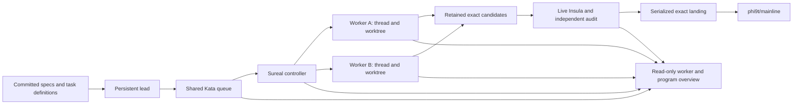

# Sureal-local two-worker collaboration — full v1 specification

Status: written specification approved by the user on 2026-10-04 UTC (2026-10-03 client date), including its normative companions. User-selected scope is two concurrent workers, separate worktrees, centralized Kata operations and an evidence-linked worker overview. Code is not implemented or admitted by this document. The historical filename is retained for stable links. Dates use the client timezone. Review-fix amendment: the user requested correction of the Claude findings on2026-10-04 UTC;53.0 now lands retention/cleanup before54, preserving all final53/54 acceptance.

## Goal and end-to-end acceptance

Give the user a dependable answer to who owns each research task, what each worker is doing, why progress is waiting or stalled, and which exact changes and scientific claims have passed verification and landed.

V1 succeeds when two actual worker threads actively overlap on independent committed tasks in distinct worktrees; Kata identifies their owners/dependencies; the overview explains both workers from concise summaries; live Insula plus independent audits verify immutable candidates; mainline integrates only the exact reviewed commit; and interruption, stale bases, handoff and cleanup recover without losing work or inventing completion.

Corenius is read-only reference material. All implementation, specs and task definitions live in Sureal. Canonical integration remains `refs/heads/phi9t/mainline`. The existing scientific program, frozen runtimes/verifiers, experiment registry, journal and HDFS retention contracts remain authoritative for scientific work.

## Specification map and authority

| Document/record | Authority |
| --- | --- |
| [Collaboration glossary](../../../CONTEXT.md) | Stable task/admission/attempt/claim/candidate/landing/closure vocabulary |
| This spec | Components, invariants, record/operation contracts, effect ordering, recovery and whole-loop acceptance |
| [Codex runtime model](2026-10-03-codex-runtime-domain-design.md) | Native session/thread/turn/item/goal identities and managed task-attempt bindings |
| [Worker state contract](2026-10-03-worker-session-state-design.md) | Operating-state transitions, progress/liveness diagnosis and detector policy |
| [Queue policy](../../research/task-queue.md) | Kata issue/spec mapping, operational procedure, current bootstrap and queue reconciliation |
| [Tickets49–54](../../research/README.md#sureal-local-collaboration-workstream) | Individually verifiable deliverables and closure evidence |
| Accepted implementation plan | Concrete files/functions/flags, adapter probes and executable test/live commands implementing these contracts |

Definitions and state tables stay in their linked authoritative document. A conflict blocks the affected operation until explicitly reconciled. A queue label, narrative summary, worker assertion or Git ancestry alone cannot authorize acceptance or landing.

## Activation and pristine-mainline gate

Before managed dispatch:

1. The current worker finishes its active task and inventories all owned tracked edits, untracked source/spec/evidence, outstanding commits and mutating processes/workspaces.
2. Land all verified owned contributions, including this spec bundle, or record an explicit unresolved disposition. Preserve unique work and frozen provenance; cleanliness cannot be manufactured by ignoring or deleting it.
3. Retain large scientific payloads through existing verified HDFS readback/live recovery. Raw data, credentials and scratch do not become incidental Git commits.
4. Reconcile the earlier models/training draft and accepted documents deliberately. Stop/release writers of canonical source and retiring workspaces; scientific jobs and held resources remain accounted for.
5. Independently prove canonical HEAD/ref/tree/index/tracked/untracked cleanliness and observed publication when required. Record exact transition base B and integration authority.
6. Review the written spec and implementation plan, admit the protocol runtime and its actual tool capabilities, then activate managed execution.

Existing history is preserved. One authoritative mainline does not require deleting every historical ref, frozen source or safely retained worktree. Each disposable workspace needs its own disposition.

Protocol implementation bootstraps through the existing manual isolated workflow. An unimplemented controller cannot certify or land itself. The initial scientific migration remains [models/training44–48](2026-10-03-first-class-models-training-design.md) after protocol admission; its dependency chain is not parallelized by having two seats.

## Components and responsibilities

- Lead: owns decomposition, admitted briefs, independent-task selection and evidence-backed review. It returns bounded repair findings rather than editing submitted candidates.
- Kata: centralized operational priorities, dependency edges, logical owner and stage. One shared local daemon/project serves every Sureal worktree.
- Controller: owns dispatch/effect receipts, workspace and thread bindings, short exclusive transition locks, candidate retention, verification/landing/recovery and scope/resource checks. It does not maintain a second assignable queue.
- Worker: one exact admitted attempt/claim/thread/worktree. It implements its brief and emits bounded progress/report/evidence within its owned scope.
- Verifier/reviewer: audits exact candidate and context independently. Independent mathematical/artifact checkers remain separate from producers.
- Observer: read-only projection of queue/runtime/receipt facts plus attributed summaries. It cannot assign/close issues, steer workers or authorize landing.
- Human: supplies intent, architecture and applicable dispatch/integration/publication authority. Authority applies only to the admitted project/ref/scope.

Proposed entrypoint is `scripts/collab.py`, using standard-library Python and installed Git/Kata/Codex/Insula. A thin entrypoint may delegate to focused private helpers for actual Git, runtime, queue, record and observation complexity. No general SDK, workflow engine, custom database/daemon or public hosting is part of v1.

## Mandatory invariants

1. At most two admitted active worker seats; one active owner per task. STARTING/UNKNOWN attempts retain occupancy.
2. Each attempt has a distinct primary thread, worktree, unique `codex/<task-id>/<attempt-id>` branch and writable output/cache/log paths.
3. Exact threadId addresses the worker. SessionId groups threads and a daemon PID can be shared; neither identifies an owner. At most one controller-requested in-flight turn per primary thread.
4. Reviewed task specs and required plans are on mainline before task admission; pin exact revisions, source B, brief digest, authorized write scope and resource rules.
5. Shared canonical refs, scientific outputs and exclusive resources have cooperative controller ownership. Workers mutate only their admitted branch/workspace/scope.
6. Submission retains one candidate C with exactly one parent B, its tree/context and a clean owned source checkout. Retain all rejected/superseded candidates before amendment/removal.
7. Verification/review bind exact C/tree/B/brief/claim/attempt/source/runtime/fixtures. Any changed candidate/context invalidates acceptance.
8. Landing serializes integration, requires clean current mainline exactly B, and advances to exact reviewed C with fast-forward-only checkout integration. No post-verification rewrite, patch, fix, merge, squash or forced ref update.
9. Prepared/result receipts and actual-state reconciliation govern uncertain effects. Lost acknowledgement never licenses duplicate launch, speculative release or false publication/completion.
10. Native goal/runtime, worker operating state/health, attempt lifecycle, Kata stage and task acceptance stay separate. Diagnostics do not kill/restart/mutate goals or free ownership.
11. Cleanup retains work/evidence and confirms stopped owned effects before removing only its disposable workspace. Other active workers and shared Git metadata survive.
12. GPU/RAM/raw/local-storage limits and existing exclusive experiment lock remain unchanged; two workers do not imply two GPU jobs.

Worktrees isolate files/index/HEAD but share refs/objects and configuration by default. This is a cooperative Git protocol, not an OS security claim. Insula restrictions must be proved on the actual invocation. Clone mode is optional later; it does not solve stale-base integration and must record object-sharing dependencies if introduced.

## Minimal records and persistence

Runtime state lives in configurable sibling `../.sureal-collab/<project-id>/`, on a local filesystem with admitted lock/atomic-write semantics. Canonical source stays clean. HDFS stores recovery exports/evidence, not live SQLite or controller locking files.

| Record | Required fields |
| --- | --- |
| Project | schema/project identity; canonical root/common Git directory/ref; explicit remote publication target/policy; Kata daemon/project identity; capacity 2; integration delegation; transition base; admitted tool/runtime/schema versions |
| Admitted task | stable task ID; Kata issue UID; spec/plan paths and Git/content identities; brief revision/digest; goal/outcome; dependencies/closure pins; B; allowed writes/exclusions; resource/phase policy; verification/retention obligations |
| Attempt | attempt/claim-generation/actor/seat; task/brief/B; workspace/branch/output paths; exact native sessionId/threadId; runtime incarnation and owned tool/process handles; acknowledgement; state; prepared operation IDs |
| Candidate | task/brief/attempt/claim; commit/tree/sole-parent B; report/evidence identities; retention ref/bundle receipt; source cleanliness; submission timestamp |
| Verification/review | exact candidate/context; commands/source/runtime/fixture pins; start/end/exits; logs/resource use; independently reopened artifact hashes; reviewed findings and accepted/rejected disposition |
| Effect | operation ID/type; expected preconditions; intent sequence; exact targets/inputs; pending/observed/result state; observed external identity and error/reconciliation evidence |
| Landing/closure | B/C/tree/accepted evidence/delegation; local integration outcome; publication, retention, cleanup and Kata-close outcomes separately; completion manifest and actual remote readback if required |
| Observation/summary | snapshot/version; per-source timestamp/cursor/coverage; exact task/claim/session/thread/turn/item bindings; attributed narrative/source anchors; operating/health transition/incident records; gaps/staleness |

Persistent organization: `project.json`, append-only `events.jsonl`, immutable operation/task/attempt/candidate/verification/landing records, owned `workspaces/`, retained `candidates/` and derived `observations/`. Exact filenames beyond these are implementation-plan choices; record content/authority are fixed here.

Use globally unique operation/attempt IDs and canonical SHA-256 digests for admitted content. Hashing serialization is versioned and deterministic. Native IDs remain opaque strings. Candidate refs or verified bundles pin objects against GC; a mutable branch name is not retention. Raw credentials never enter records.

Under the exclusive project lock, durably append a prepared/result event, fsync it, write associated records through temporary file + fsync + atomic rename + parent-directory fsync, then update the small current projection. Retain event sequence and record hashes. Torn trailing journal bytes are diagnosed/reconciled against retained records; corruption of earlier committed history blocks mutation. A crash between event/record/projection writes recovers from the durable evidence, not a guessed status. Unsupported filesystem durability/locking fails project admission.

Derived overview snapshots/summaries have their own cache area and may be rebuilt. Their loss cannot change ownership or acceptance. Queue restoration targets a fresh isolated database from a project-only export, never overwrites the shared live daemon database; restored identities/owners require reconciliation before dispatch. Runtime record/queue restoration is itself independently verified before recovery is claimed.

## Operations and failure behavior

Command names below are the proposed interface, not currently available capabilities. Exact argument parsing belongs in the implementation plan; these effects/preconditions are normative.

| Operation | Required behavior |
| --- | --- |
| `init` | Admit canonical/project/runtime/Kata identity and existing-work disposition; produce project receipt; no worker launch |
| `status` | Read-only text/JSON snapshot of both seats, tasks/queue, current states/evidence/blockers and source freshness; no source/queue mutation |
| `task import` | Search/map committed task definitions to scoped Kata issues, idempotently create missing issues/dependency edges and link pins; never blindly mark old work done |
| `task close` | Validate independent ticket-specific closure, retain the separate Kata-close effect/readback; manual evidence-backed closure remains the bootstrap path until this operation is admitted |
| `task start` | Check readiness/closure/scope/capacity/B, reserve attempt intent, claim unique Kata actor, allocate owned worktree, bind exact fresh thread, obtain matching acknowledgement and start bounded work |
| `task submit` | Match current owner/claim/thread/attempt/B, stop/freeze source, check single clean commit, retain candidate and record report; no acceptance inference |
| `task verify` | Materialize retained C separately, run admitted checks/live Insula, independently audit artifacts and retain review disposition; never test mutable worker leftovers |
| `task repair` | Preserve C1/evidence and return bounded findings. A still-live waiting attempt may receive an authorized repair turn; an EXITED/FINISHED attempt requires a fresh claim/thread/workspace at the same admitted base/brief. New C2 always needs new verification |
| `task refresh` | Preserve old attempt/candidate/work, stop/reconcile it, admit new base/claim/attempt/thread/worktree and explicit retained inputs; no inherited verification |
| `task takeover` / `task abort` | Retain prior work/effects, prove stop, record disposition and retire claim before releasing/transferring owner; unresolved state refuses replacement |
| `task land` | Serialize exact conditional fast-forward checkout effect, retain local result, then configured publication/retention/closure facts; other unrelated worker can continue |
| `recover` | Compare prepared effects with actual Kata/Git/thread/process/artifact state and reconcile; no blind launch/ref retries |
| `cleanup` | Confirm stopped owned effects and retained work/evidence; use Git worktree removal on validated owned path; preserve shared repository/other seats |
| `observe` | Collect scoped public/runtime/receipt facts and build summaries/overview; optional localhost HTML view; no task/runtime/goal control effects |

Failures carry operation identity, stable reason, retry/reconciliation requirement and retained evidence. Refusal reasons include UNADMITTED_SPEC, DEPENDENCY_OPEN, CAPACITY_FULL, OWNER_CONFLICT, SCOPE_CONFLICT, RESOURCE_WAIT, STALE_BASE, DIRTY_SOURCE, CANDIDATE_MISMATCH, VERIFICATION_INCOMPLETE, UNKNOWN_EFFECT, RETENTION_INCOMPLETE and SOURCE_UNAVAILABLE. No force override clears these implicitly. A retry references its prior operation ID; explicit recovery determines whether the effect already happened.

## Kata admission and dispatch handshake

Committed `.kata.toml` binds worktrees to one admitted Sureal project; the controller verifies actual daemon/project identity on use. A stable Git task-to-issue mapping contains task/spec paths and issue UID, without mutable owner/status. Import initially covers49–54,53.0 and44–48, then audited relevant research follow-ups. Search before create; use a project/task-derived idempotency key. Task revisions update the same logical issue through an explicit admitted revision rather than duplicating it.

The lead chooses up to two independent unowned ready issues. `blocked-by` edges represent prerequisites; closed predecessors are rechecked against their accepted closure evidence. Default user actor is not sufficient: each attempt uses `sureal/<attempt-id>`. A Kata claim reserves the logical owner; controller records describe the execution of that owner rather than creating another claim service.

Dispatch ordering:

1. Under lock, verify current B, pinned specs/dependencies/scope/resources and available seat; persist a prepared attempt and reserved seat.
2. Claim Kata with the unique actor; read back owner/revision. Store one revision-conditional assignment metadata object binding task/brief/claim/attempt/seat/workspace/runtime identifiers. Unknown or changed owner retains the reservation and stops dispatch.
3. Create/validate worktree at B and write its identity receipt. Recheck mainline/task preconditions before launch. A changed B produces STALE, with explicit retention/release disposition.
4. Create one fresh worker thread configured for the bounded brief/workspace and record returned threadId/sessionId before its work turn. If thread creation acknowledgement is lost and identity cannot be recovered safely, retain UNKNOWN; do not create another thread by retry.
5. Send the exact assignment with claim generation, brief digest and controller identity. Record matching thread/turn acknowledgement before RUNNING. A lost work-start acknowledgement is reconciled through exact-thread observations, never by resending speculative work.
6. Worker progress, repair, submission and control operations check current issue owner/assignment/claim/thread/attempt. Old-generation updates are rejected. Native goal mutations require the applicable admitted authority and tool rules.

Kata claim, assignment metadata, thread creation and turn launch are separate effects, not an atomic transaction. Persist prepared/result records around each boundary. External effects run with the seat reserved; short local lock sections fence local transitions and recheck identity after bounded calls, not entire worker execution. A configured unavailable Kata source blocks new mutation; no silent fallback owner queue.

For takeover, first retain prior work, confirm actual thread/queued goal/tool effects are stopped, and record old disposition. Then retire its claim and transfer/release Kata ownership through explicit recorded effects. Missing heartbeat alone is not stop evidence. Manual/forced owner changes or stale metadata are reconciliation incidents, not automatic permission to launch.

## Scope, resources and concurrent landing

Concurrent tasks declare write paths with resolved project roots, directory ancestry and shared output/resource keys. Reject overlap, aliases/symlink escape or uncertain ownership before dispatch. V1 can use conservative directory-level claims; clever file-level scheduling is unnecessary. Immutable inputs may be shared; mutable caches/build outputs may not.

The shared GPU lock governs producer and verifier execution. Resource waits have owner/reason/expected event and hold the task claim. Capacity2 is not a resource-cap increase. Use existing scientific budgets, including previously extended scoring time allowances. Resource or infrastructure failure is not a research negative.

If T1/T2 start from B and T1 lands C, T2's D with parent B is stale, even for disjoint changes. Preserve D and its evidence, explicitly refresh T2 at C through a fresh attempt/worktree/thread, carry forward retained inputs, produce E with parent C and obtain fresh verification. Landing itself never rebases or reuses D's acceptance. Continuous rebase/concurrent merge queues are outside v1.

## Candidate, verification, integration and closure

Candidate identity is exact commit/tree/parent plus task/brief/claim/attempt/workspace context. Submission refuses zero/multiple commits, merges, wrong base or dirty tracked/index/untracked source. Declared ignored build paths remain explicit; verification has no access to incidental ignored worker inputs. Freeze source and reconcile outstanding writers before candidate verification/landing. A retained immutable candidate does not itself stop the worker: submission records the explicit handoff/freeze acknowledgement and outstanding-turn/tool/goal-continuation disposition. While waiting for review, a still-live attempt may remain RUNNING with operating WAITING; it is not labeled EXITED/FINISHED merely because a turn ended. A terminal attempt is never reopened for repair; retain its C1/work and allocate a fresh attempt at the admitted base/brief, then verify C2 under its new context.

Retain candidate objects/report/evidence before repair or cleanup. Verification materializes exact C in a fresh detached/source workspace with immutable inputs and declared output paths. Required implementation milestones execute live Insula and independent artifact/math checks. Host tests complement this proof. A worker pass message or native goal complete state cannot authorize C.

Under the integration lock, re-read clean canonical mainline=B, C's sole parent/tree/context, accepted verification/review and delegation. Persist PREPARED landing; use fast-forward-only checkout integration; independently verify HEAD/tree/index/working state=C and clean; then persist local LANDED receipt. `update-ref` alone is insufficient for a checked-out branch. Cooperative lock enforcement does not exclude arbitrary external Git processes; unexpected mutation yields uncertainty/stale refusal.

Remote publication targets explicit configured ref/remote. Re-read the remote after ambiguous acknowledgement; never force-push or roll back observed local landing to invent a clean outcome. Publication may be not-required by admitted policy; required publication remains pending until observed. Retention/cleanup/Kata close are recorded separately.

Close Kata only after task-specific acceptance, required integration/publication/retention/cleanup obligations and independently reopened closure evidence are satisfied. Commit reviewed closure manifests/journal findings when required by the ticket; retain large payloads through established HDFS readback/live recovery. A finite audited research negative may close its investigation; an incomplete executable gate cannot.

## Recovery matrix

| Interrupted/mismatched boundary | Required reconciliation |
| --- | --- |
| Prepared claim, Kata unowned | Recheck reservation/base/brief; retry same prepared claim only after proving no execution exists |
| Kata owned, metadata/result absent | Read exact owner/revision, repair metadata under identity checks; hold seat until reconciled |
| Worktree created, receipt absent | Inspect owned path/common directory/branch/B; retain or reconcile; never overwrite foreign/dirty state |
| Thread creation acknowledgement lost | Recover exact thread binding from admitted runtime evidence or hold UNKNOWN; no blind creation retry |
| Turn launch acknowledgement lost | Inspect bound thread/turn/queued effects; reconcile running/completed/unknown; no duplicate dispatch |
| Candidate retained, submission projection absent | Reopen C/context/report and reconstruct submission; do not create another candidate silently |
| Main=B, prepared C retained | No completed integration; resume only after all preconditions are revalidated |
| Main=C and tree matches | Record observed integration; reconcile publication/closure/cleanup without repeating work |
| Main neither B nor C, dirty checkout or mismatched tree | Hold affected project mutation and require explicit Git-state diagnosis; no reset/force/rewrite |
| Local C landed, push acknowledgement lost | Read configured remote; distinguish published/pending/divergent/unknown and record actual outcome |
| Kata close acknowledgement lost | Read issue close event and its evidence; reconcile already closed versus pending without fake acceptance |
| Cleanup failed after C landed | Preserve LANDED and pending cleanup; retry only owned cleanup, not worker execution |
| Observer/summary unavailable | Display stale/UNKNOWN coverage; no ownership or process state mutation |

Unknown effects demonstrably confined to one attempt hold its seat/conflicting scopes; unrelated known-safe work may continue. Uncertain shared Git/queue/resource identity holds all affected mutation. Before release, preserve unsubmitted work, every candidate and closure/protocol history, confirm all owned effects stopped and verify disposable path ownership. Cleanup rejects canonical/foreign/symlink paths and uses Git worktree removal, preserving common Git metadata and other active attempts.

## Worker state and human overview

The [worker state contract](2026-10-03-worker-session-state-design.md) is normative: IDLE/PURSUING/WAITING/BLOCKED/PAUSED/LIMIT_REACHED/FINISHED/ERROR/UNKNOWN plus HEALTHY/STUCK_SUSPECTED/HUNG_SUSPECTED/HUNG_CONFIRMED/UNKNOWN health. Native goal/runtime, attempt and task states are separate. Each transition/diagnosis records identity, reason, time/duration, evidence, effective policy and next-event/unblock condition. No diagnosis grants restart, takeover, goal mutation or task closure.

The browser overview and matching text/JSON status have three views:

1. Two worker cards: task goal; Kata issue/pinned spec/plan; exact session/thread/current turn/claim/attempt/worktree; base/candidate; current work; recent findings/results; blocker; next action; resource and verification/integration/cleanup state.
2. Central queue: ready, owned, running, waiting, blocked, needs-verification, needs-landing and closed groups, dependency explanations and acceptance evidence. Runtime/queue discrepancies are visible.
3. Task/spec progress and incident timeline: draft/review/landed/admitted definitions; native/operating/health graphs with current state and transition blockers; historical attempts, stale refresh, incidents and verified outcomes. Unaudited historical research shows UNKNOWN/NOT AUDITED.

Summaries target at most 120 words per current worker card. Generate narrative checkpoints in the existing lead/worker workflow from bounded public message/tool/receipt deltas; label observed, worker-reported and inferred content. Retain item/event/artifact anchors, coverage range, gaps, generation time and source hashes. Worker checkpoints occur at acknowledgement, material finding/failure/wait, submission and exit. Collector corroborates them; source absence explicitly means partial coverage, not a fabricated transcript. Raw traces are an optional scoped/sanitized drilldown. Private reasoning and credentials are excluded.

Use read-only runtime metadata/history methods with actual capability probes. Do not resume/start/interrupt a thread to observe it. Existing controller notifications may supply deltas, but reconnect reads supported persisted sources and does not assume notification replay. Deduplicate by exact identity; inherited fork history cannot count as current attempt progress. Pagination/compaction/retention gaps remain explicit.

Visible overview polls every 5 seconds; each source shows its own timestamp and becomes stale after 15 seconds without successful observation. Narrative generation is event/turn-coalesced, never per token or per UI poll. These freshness intervals are not worker execution caps. Status/observer errors do not mutate control state. Local HTML uses the controller's snapshot interface and escaped content; it is not publicly deployed.

## Milestones and actual acceptance gates

| Stage | Ticket | Required live proof |
| --- | --- | --- |
| P0 | [49](../../research/tasks/49-collaboration-project-admission.md) | Pristine base, project/Kata/runtime identity, durable lock/record refusals and scoped queue recovery |
| P1 | [50](../../research/tasks/50-collaboration-worker-attempts.md) | Two actual threads actively overlap in distinct worktrees; exact claims/acknowledgements; third-start/duplicate/scope/resource refusal; explicit handoff |
| P2 | [51](../../research/tasks/51-collaboration-candidate-verification.md) | Single exact candidate retention, separate live verification, bad-context refusal and C1/C2 evidence isolation |
| P3 | [52](../../research/tasks/52-collaboration-landing-recovery.md) | Exact B→C landing, real interruption/refusal probes and honest local/remote reconciliation while unrelated work continues |
| P3.5 | [53.0](../../research/tasks/53-0-collaboration-retention-cleanup-foundation.md) | Exact landed retention/cleanup/check helpers, fresh HDFS/live recovery, project-only queue restore and per-seat cleanup |
| O0 | [54](../../research/tasks/54-worker-program-observability.md) | Live readable thread/history joins, accurate summaries/state/queue views, progress/hung false-positive tests and freshness/reconnect/no-mutation audit |
| P4 | [53](../../research/tasks/53-collaboration-cleanup-closeout.md) | Full concurrent pilot, stale refresh/reverification, per-seat cleanup, artifact retention and independent complete-loop closeout |

Order: current owned integration closeout → pristine mainline → 49 → 50 → 51 → 52 → 53.0 → 54 → 53 → models/training44–48. Implementation tasks can be decomposed into independent scopes in the accepted plan; admission dependencies still bind. Ticket54 owns its live observation exercises using49–52 and landed53.0, including submission/stale refresh/cleanup; it does not wait for final53. The full runtime implementation is already on mainline before the pilot baseB is selected. Closing53.0 is implementation-foundation acceptance, not full-loop admission.

The full pilot uses two bounded real tasks from landed specs, both at B, with independent declared write scopes. Retain observed overlap and exact worker/issue/workspace identities. Land reviewed C for T1; refuse stale D for T2; preserve it; explicitly refresh T2 and independently verify E with parent C before landing E. Prove candidate/source isolation while the other worker is active, cleanup preservation, truthful summaries, resource serialization and crash recovery. The concrete pilot briefs53.A/53.B are defined in [ticket53](../../research/tasks/53-collaboration-cleanup-closeout.md#concrete-pilot-briefs). Import each with a stable subtask ID and pinned spec anchor, `related` to53; do not create a parent/dependency cycle that prevents their execution. They produce useful operating/incident documentation in disjoint directories and exercise actual worker, verifier and integration effects. Toy subprocesses, static screenshots and self-reports alone do not pass.

Every implementation milestone retains actual live Insula commands/logs/exits, source/runtime pins, independent reopened artifacts, refusal/fault results and exact landed evidence. The research program's quality/overfit/heldout gates remain separate. Protocol completion establishes collaboration reliability, not model performance.

## Limits, trust and reference baseline

V1 has one lead/local controller, capacity 2, cooperative worktree/ref/scope rules, centralized local Kata and local overview. Multi-host dispatch, federation, clone implementation, capacity beyond two, auto-rebase/merge, autonomous restarts, public dashboards and generic agent frameworks are deferred. No source deletion or external messaging is authorized by a displayed status.

Inspected installed capabilities: Kata v0.14.3 (claim/ready/dependencies/actor/meta revision condition/events/scoped export); Codex CLI 0.159.3 and daemon 0.160.0 with generated thread/turn/goal schema. Version/schema presence is not live runtime proof. Admit upgrades/capability changes explicitly instead of using newer flags from memory. Corenius was read-only reference; its rebase-before-gating landing helper is not this protocol's integration path.

Primary references: [Git worktrees](https://git-scm.com/docs/git-worktree), [Git cloning](https://git-scm.com/docs/git-clone), [Git fast-forward integration](https://git-scm.com/docs/git-merge), [Kata quickstart](https://github.com/kenn-io/kata/blob/main/docs/get-started/quickstart.md), [Kata shared-project model](https://github.com/kenn-io/kata/blob/main/docs/workflows/sharing.md), [Codex App Server](https://learn.chatgpt.com/docs/app-server) and [Codex Goals](https://developers.openai.com/cookbook/examples/codex/using_goals_in_codex). Local schema/help inspections determine the actual admitted adapter surface.
