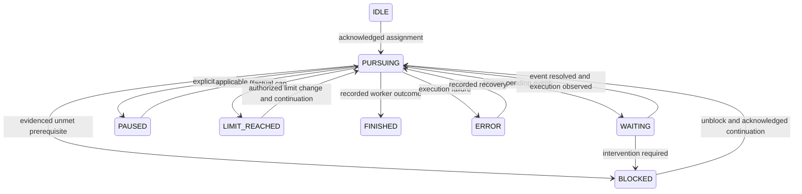

# Explicit worker session state and progress health

Status: normative companion to the full v1 specification, pending review; required part of overview54 and concurrent protocol admission53. This specifies observation/diagnosis, not an implemented watchdog or a grant to alter worker goals.

## Goal and identity

For each owned worker, answer: what objective is it pursuing, can it act, is it making progress, is execution responsive, what would unblock it, and how trustworthy/current is that answer?

Join exact project/task/spec/claim-generation/attempt/session/thread/workspace identities under the [Codex runtime model](2026-10-03-codex-runtime-domain-design.md). SessionId groups threads; primary threadId is the worker address. Retain current/last turnId for progress, not ownership. Record the assigned objective and native goal identity/status where available. The inspected schema has no separate goal ID: bind thread ID, goal creation time and objective digest, plus retained update identity; a task-only session explicitly shows NO NATIVE GOAL. Session activity, native goal lifecycle, attempt/process lifecycle, progress health, Kata task stage and integration outcome are distinct fields. Never infer task completion or released ownership from session idleness, goal completion or a health warning.

## Operating state

| State | Entry evidence | Exit condition / next action |
| --- | --- | --- |
| IDLE | No owned active attempt/objective, after safe release; session may remain loaded | New acknowledged assignment |
| PURSUING | Assigned runnable objective plus observed worker activity or an evidenced eligible continuation | Pending wait, known blocker, explicit pause/limit, recorded outcome/error or uncertain observation |
| WAITING | Known normal pending operation/event: tool result, resource lock, approval response or continuation gate; waiter/owner and expected event recorded | Event completes and execution resumes, or evidence establishes an intervention-dependent blocker/error |
| BLOCKED | Known unmet prerequisite/condition prevents useful authorized work; blocker, attempted alternatives, unblock condition and responsible party recorded | Prerequisite fulfilled or authorized scope/plan change, then explicit acknowledged continuation |
| PAUSED | Actual explicit pause/stop request or native paused state recorded, with reason/source | Explicit applicable resume authority and observed continuation |
| LIMIT_REACHED | Actual native budget/usage limit or admitted execution cap reached | Applicable budget/resource change and observed resumption; no completion inference |
| FINISHED | Assigned worker objective has a recorded outcome/handoff; native complete claim labeled by its actual source | Remains historical; another assignment gets a new attempt. Task verification/landing can remain pending |
| ERROR | Actual failed execution/runtime error, with failure identity and disposition | Recorded recovery and observed continuation, or terminal disposition/new attempt |
| UNKNOWN | Missing/stale/contradictory identity, runtime or state evidence prevents classification | Fresh reconciled observations; retain last known state separately |

BLOCKED is a coordination diagnosis with concrete evidence. It is not equivalent to a single failed test, a busy GPU, a long computation, slow learning or repeated internal investigation. Normal bounded waits retain WAITING; intervention-dependent conditions use BLOCKED. An active native goal on an idle thread can be between turns: inspect continuation gates/queued work and show their evidence. Without it, expose unknown scheduling rather than guessing that the goal stopped.

Diagram shows the normal paths. UNKNOWN can replace any current observation when evidence is unavailable/conflicting; reconciliation returns to the evidenced state, never blindly to PURSUING. A pause/limit/error during WAITING or BLOCKED follows the same evidence rules. FINISHED does not transition back into the same attempt; IDLE after confirmed release and a fresh assignment is separate protocol work.

## Health assessment: responsive versus progressing

| Health | Required evidence | Meaning / response |
| --- | --- | --- |
| HEALTHY | Fresh runtime/progress observations consistent with the current phase and declared wait/operation | Continue observing; successful task acceptance is not implied |
| STUCK_SUSPECTED | Worker remains responsive but exceeds its admitted phase progress window or repeats equivalent failures without a new evidenced finding/strategy | Highlight the repeated pattern and missing progress; lead reviews a bounded replan or escalation |
| HUNG_SUSPECTED | Fresh observer/transport is available, while worker-specific expected responsiveness/progress signals are repeatedly overdue and no valid declared wait explains it | Show probe evidence and last responsive operation; investigate process/tool/transport separately |
| HUNG_CONFIRMED | Explicit technical diagnosis tied to the exact session/process/operation, with retained supporting evidence and reviewer identity | Lead/controller follows separately authorized interruption/recovery; diagnosis alone does not free ownership |
| UNKNOWN | Observation outage, unsupported worker-specific liveness, conflicting sources or insufficient phase policy | Show coverage gap/last known state; neither stuck nor hung is asserted as fact |

Health is an overlay, not a transition that falsifies goal intent. For example `PURSUING · STUCK_SUSPECTED` means alive, still pursuing, apparently looping; `WAITING · HEALTHY` may mean a long live training job; `PURSUING · HUNG_SUSPECTED` means responsiveness needs investigation. `BLOCKED · HEALTHY` is also valid: the worker has honestly identified a blocker. A completed/paused session has no obligation to emit execution heartbeats; show health applicability explicitly.

Track last meaningful progress, last worker responsiveness, last job/artifact progress and last observer success separately. Meaningful progress includes new findings, changed hypotheses supported by evidence, narrowing a failure, successful milestone checks or durable task artifacts. Token output, identical retries and repeated status paraphrases do not alone reset progress. Failed experiments can produce meaningful evidence; an honest negative result does not imply STUCK. Distinguish independently observed progress from worker-reported progress.

## Detection policy and transition records

Each admitted phase has a visible, versioned policy: meaningful-progress soft window, equivalent-failure repeat threshold, expected operation/wait identity and deadline, available heartbeat/progress signal, and worker-specific probe timeout/missed-probe threshold. V1 defaults below complete the detection contract; a task/phase can override them through its pinned brief/policy. Overrides must be visible and retained, never implicit changes to scientific execution limits.

| Profile / setting | V1 default | Application |
| --- | --- | --- |
| Development/investigation progress window | 10 minutes | Responsive PURSUING worker without meaningful progress becomes eligible for suspicion |
| Long computation/acquisition/scoring progress window | 30 minutes | Evaluate available declared job/artifact progress; valid quiet operations remain protected by their admitted wait/deadline contract |
| Equivalent-failure pattern | 3 consecutive equivalent failures without a new supported finding/strategy | Annotate loop pattern; no automatic stop or native blocked mutation |
| Suspicion hysteresis | 2 qualifying observations at least 5 seconds apart | Avoid transient state changes; clear on new evidenced progress/responsiveness as appropriate |
| Worker-specific supported probe | 5-second probe timeout; 3 successive misses | Eligible for HUNG_SUSPECTED only with fresh observer and no valid wait; absence of a supported non-mutating probe remains UNKNOWN |
| UI/source freshness | 5-second visible refresh; 15-second stale source | Observation health, not a worker timeout |
| Expected long-operation deadline/heartbeat | Actual admitted operation budget and declared signal contract; heartbeat may be unsupported | Required before long-operation dispatch; no default shorter cap is substituted |

The progress window is a soft diagnostic threshold, not cancellation. STUCK_SUSPECTED requires a responsive worker plus overdue meaningful progress and no valid phase/wait explanation, sustained through hysteresis. Equivalent-failure count explains a loop; it cannot alone force a suspicion before the phase window. For a valid ongoing operation with no heartbeat support, show limited progress/liveness coverage, retain WAITING and its actual budget, and do not manufacture a hang from silence. Resource/dependency wait can become overdue/intervention-dependent using its explicit condition, not a universal job deadline.

Admission records effective thresholds and refuses an enabled detector with missing required values. The overview's five-second refresh/fifteen-second stale-source rules are observation freshness, not execution deadlines. These policies do not shorten previously admitted scientific time budgets.

A stuck condition needs the current goal/attempt/phase and a reviewed definition of equivalent failures. Hysteresis requires the configured sustained/repeated evidence; clear a suspicion only on a new meaningful progress or confirmed responsiveness event as appropriate, preserving the incident history. A live long-running operation can reset progress from declared job/artifact signals without a chat message. Exceeding an expected operation deadline is diagnostic evidence, not proof of a hang by itself.

A responsive app-server/collector does not prove an individual worker is responsive. Missing worker-specific probes leaves hung health UNKNOWN or suspicion explicitly limited to the available evidence. A disconnected observer marks UNKNOWN/stale, never HUNG_CONFIRMED. Ordinary tool I/O, resource/approval waits, native goal continuation between turns, compaction and long evaluation require phase-aware treatment. No generic silence timeout declares a worker dead.

Each operating-state transition and health assessment records previous/new state, since/duration, reason code, native goal/runtime snapshot, exact identity, source event/item/receipt references, expected next event/unblock condition, effective detector policy and confidence/source classification. Replayed/out-of-order events must not regress current state or overwrite the wrong attempt. Detector findings enter the overview's attention list; they do not automatically force-claim, kill, restart, resume, pause, mutate goals, mark acceptance or release a seat.

## Native goal and Kata mapping

The inspected daemon 0.160.0 goal schema has `active`, `paused`, `blocked`, `usageLimited`, `budgetLimited`, `complete`; retain the native value independently. PURSUING is our richer operating view, not a renamed API enum. Native completion is a recorded goal claim, not independent task acceptance. Native blocked and our coordination BLOCKED can differ and must show why. Goal pause/resume/block/complete mutations remain subject to applicable user/runtime/tool rules; observing a blocker or stall never grants a mutation. In particular, native blocked policy is not bypassed by a health detector or queue label.

Kata displays the operating/health view and incident/unblock references through controller-owned metadata/derived labels. Queue readiness/owner remain native Kata facts. Health suspicion does not close an issue or make it unowned. Explicit takeover retains work, confirms stop, retires old claim/attempt, then assigns a replacement as specified by the queue policy.

Sources: installed daemon schema generation/read-only inspection and official [Codex Goals documentation](https://developers.openai.com/cookbook/examples/codex/using_goals_in_codex), which describes thread-scoped lifecycle, event-driven continuation and evidence-based completion. Actual signal availability and diagnosis remain live implementation gates in [task54](../../research/tasks/54-worker-program-observability.md).
